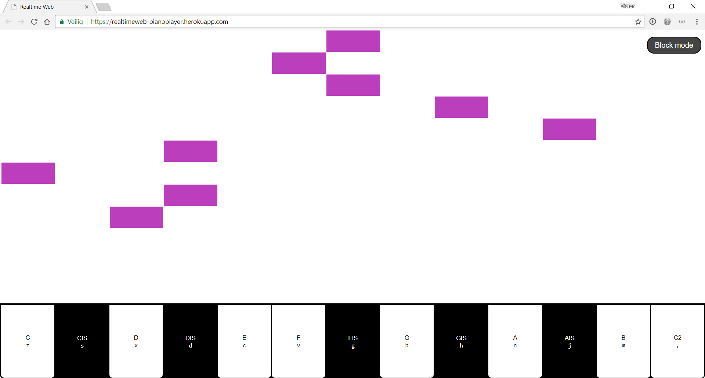

# Real Time Piano
Using this app you can compose a song together with others using [socket.io](https://socket.io). This is a school project where the goal is to build a real-time web application using websockets (recommended) or another technique.

## Prerequisites
- Git
- Node
- NPM

## Get started

1. Clone the repo: `git clone git@github.com:velomovies/real-time-web.git`
2. Get all the dependencies `npm install`
3. Run `npm start`  to start the server.
4. Navigate to`localhost:5000` to see the application.

## Dependencies 

- [Socket.io](https://socket.io) is used to make connecting to the websocket easier
- [Nunjucks](https://mozilla.github.io/nunjucks/) for templating

## Roadmap

- Styling
- Individual sessions

## License
GPL-3.0 © Victor Zumpolle